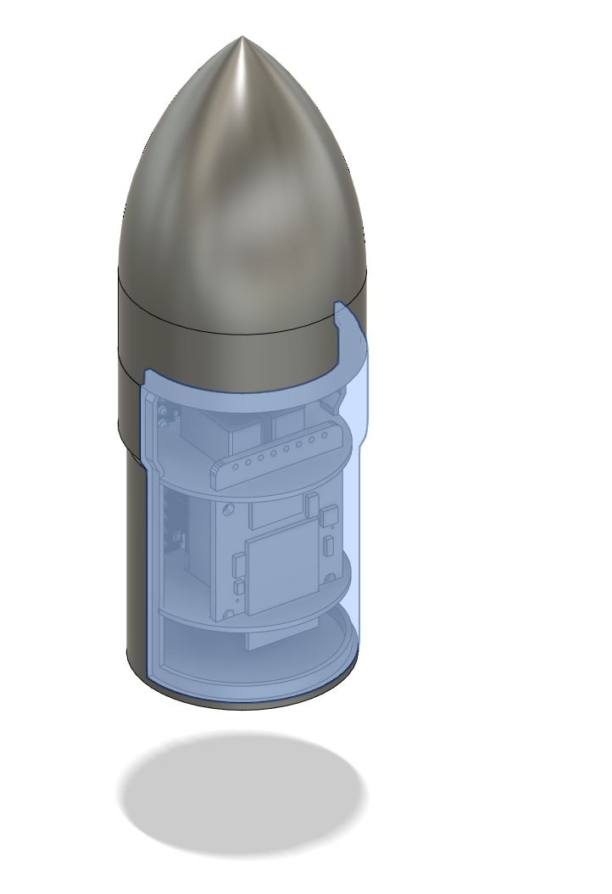
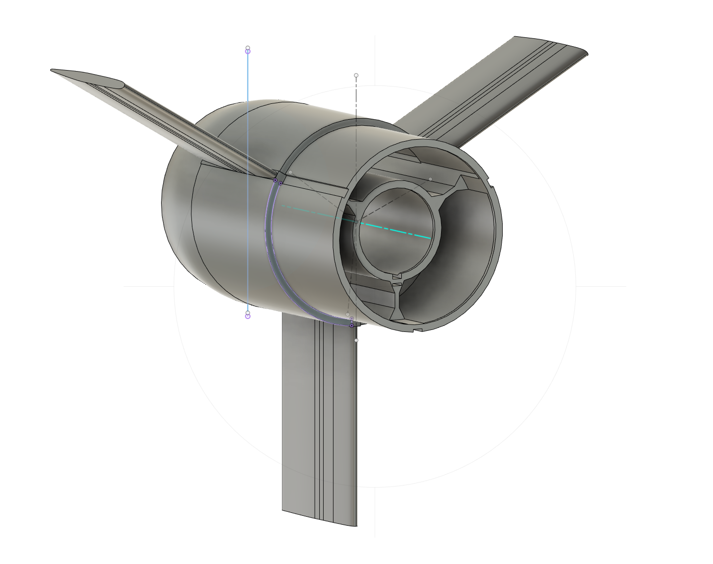
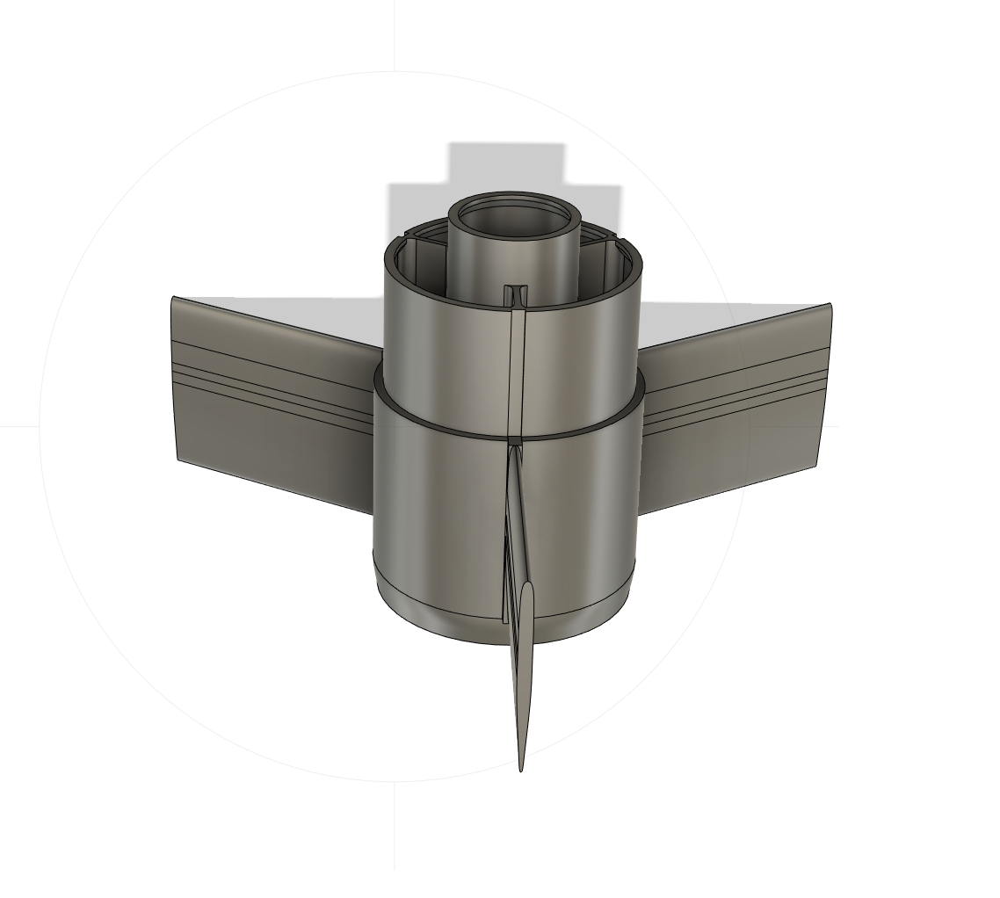

# This page describes the design and construction of the launch vehicle for Mission A: Nano-Rocket

Note: This page is specific to `Mission A: Nano-Rocket`. For information about a different vehicle or mission, select the appropriate branch.

## Overview 

The primary goal is to design and construct a safe and low-cost model rocket capable of carrying a flight computer and sensor package as the payload in the nosecone. The rocket design shoud be suitable for construction with a typical FDM 3D printer and available building materials. 

## Design Requirements

## Design History of Nano-Rocket

### Nosecone Design

I made these designs with Autodesk Fusion 360 using the hobbyist license. This is not my favorite CAD program, but it is nice for small projects. The part construction seems straightforward, but assembly seems to be missing a way to set mates in the traditional way. The developers have claimed that the added joints instead of mates, but I have not quite figured out how they work yet. 

Nosecone V1 
  - first draft in CAD
  - first printed protoype showed that the split cone design was problematic

 

Nosecone V2 
  - one piece nosecone with split coupler cylinder for access
  - cylinder/coupler diameter reduced for streamline  
  - closing two piece clyinder complicates problem as in V1
  - discs or rings to hold the electronics... almost worked

 

Nosecone V3 
  - one piece nosecone with one piece coupler cylinder for simplicity
  - pcb board added to replace MCU discs and reduce wiring
  - floor of clyinder shaped to hold pcb carrier and batteries
  - cleiling of cyinder shaped with holes to support SD card board, hold sensor boards, and allow wiring access
  - parabolic nose profile added for reduced drag in sub-sonic flight

 

### Tail Design

Tail V1 

  - the purpose of the tail piece is to hold the motor and the fins securely to the body tube
  - the 'boat tail' is intended to reduce drag, the angle is set at 10 degrees
  - the first print was very heavy, which can lead to a slow and unstable rocket 

 

Tail V2 

  - all wall thickness reduced for weight
  - body tube coupler length reduced for weight
  - boat tail length reduced for length

 
